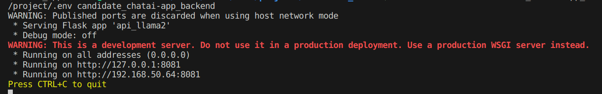

# Job Candidate Chat AI Assistant
Job Candidate Chat AI Assistant is a **generative AI application** that enables users to 
learn more about a **job candidate's background, skills and projects through an interactive 
chat interface**. It is designed as a Retrieval Augmented Generation (RAG) workflow
where the prompts sent to an LLM are grounded on the documents provided by the candidate
(i.e. stored as files in database/documents), thereby allowing the LLM to be able
to be prompted to respond on specific questions about the job candidate.

The following is an example of the AI Assistant.<br><br>


This application can be deployed entirely on a single machine with a GPU without 
requiring any data to be sent to an external API. The chat model is based
on a *quantized* version of **Meta's Llama 2 Chat** variant that is open-sourced and 
publicly available for download. When running inference, the model load is shared across
the system's GPU and CPU components.

This application has been tested to successfully run on a laptop with a single RTX 2060 
GPU that has 6 GB of GDDR6 memory running on Ubuntu 22.04 LTS.

The application uses open-source Python tools including ChromaDB, Langchain, llama.cpp, Streamlit and Flask. The application and logic flow as well as the architecture
diagram and my comments are available in the following [slide deck](https://github.com/Aznoryusof/candidate_chatai/blob/master/diagrams/SAP%20Generative%20AI%20COE%20Slides.pdf).

The following describes the step-by-step process of setting up the application using
docker containers on a Linux machine.

## 1. Installation and Environment Setup 
1. Pre-requisites.<br>
    The following are required to run the application:
    - Python
    - Docker
    - NVIDIA CUDA Toolkit and [NVIDIA Container Toolkit](https://docs.nvidia.com/datacenter/cloud-native/container-toolkit/latest/install-guide.html)

2.  Clone the repository to a folder of your choice. 
    ```
    git clone git@github.com:Aznoryusof/candidate_chatai.git
    cd candidate_chatai
    ```
3.  Set up Python Virtual Environment to run script for database creation.
    ```
    pip3 install virtualenv
    virtualenv venv
    source venv/bin/activate
    pip install -r requirements.txt
    ```

4.  Add Environment Variables.<br>
    Create an .env file in the main directory with the variables shown below.
    The API_KEY can be any string as the model server is running locally.
    Here I have used 123 as an example.
    ```
    API_KEY=123
    OPEN_AI_BASE=http://candidate_chatai-app_backend:8081
    DB_PATH=database/db
    DOCS_PATH=database/documents
    LOG_FILE_PATH=logs/llm_output.log
    EMBEDDINGS_MODEL=hkunlp/instructor-large
    EMBEDDINGS_PATH=models/embeddings
    SEED=99
    TEMPERATURE=0
    TOP_K=4
    CHUNK_SIZE=4096
    CHUNK_OVERLAP=0
    MAX_HISTORY_LENGTH=4
    REPHRASED_TOKEN=<REPHRASED>
    ```
    
5.  Create the vector database.
    ```
    python database/create_db_from_docs.py
    ```
    The code above would also download the embeddings model and save the
    embeddings model in models/embeddings (specified in the .env file created 
    above). The directory containing the models and the .env file would later 
    be attached as volumes to the docker containers at runtime in the subsequent
    steps.
    For the vector database, Chroma DB is used. This database stores all the
    documents as a vector embedding so that it can be searched over quickly by
    the retriever.   

7.  Retrieve the model files.<br>
    Two variants of the Llama 2 chat models are provided in this example - 
    a 7B and a 13B model. While the 13B model is slightly more performant, inference
    time is much slower and the model takes longer to download than the 7B model. The two models can be downloaded from my Hugging Face repository into the models directory with the 
    commands below.

    7B model:
    ```
    wget https://huggingface.co/Aznor/llama-2-chat-7b-q4_0/resolve/main/ggml-model-q4_0.gguf -b -P models
    ```
    or

    13B model:
    ```
    wget https://huggingface.co/Aznor/llama-2-chat-13b-q4_0/resolve/main/ggml-model-q4_0.gguf -b -P models
    ```

## 2. Deployment with Docker
In this section, the **three services** that will be deployed as docker containers
are:
- Backend Model API using Flask
- Backend Model Server using [llama.cpp](https://github.com/ggerganov/llama.cpp)
- Frontend Chat Interface Application using Streamlit

Before we can run the services, we need to create a docker network:
```
docker network create candidate_chatai-network
```

Run the following docker instructions in the main directory for each of the service.

1.  Backend Model API using Flask.<br>
    Build the docker image.
    ```
    docker build -t candidate_chatai-app_backend -f ./0_docker_files/Dockerfile_app_backend .
    ```
    Then run the docker image.
    ```
    docker run --name candidate_chatai-app_backend --network=candidate_chatai-network -v ./.env:/project/.env candidate_chatai-app_backend
    ```
    The following shows the output of the container when running correctly<br>
    
    


2.  Backend Model Server using llama.cpp.<br>
    The llama.cpp is a repository that allows Llama models to run inference
    using 4-bit quantization and plain C/C++, thereby allowing these models to 
    be used on consumer GPU+CPU machines.<br>
    
    First clone the repository in the current project folder (i.e. candidate_chatai). *Note: Currently in the
    implementation shown below, the cloning is done outside the container, but this can be done within the docker container by changing the configurations in the ./0_docker_files/Dockerfile_llama_cpp file.*
    ```
    git clone git@github.com:ggerganov/llama.cpp.git
    ```
    Then build the docker image.
    ```
    docker build -t candidate_chatai-llama_cpp -f ./0_docker_files/Dockerfile_llama_cpp .
    ```
    Next run the docker image as a container. Use either the 7B or the 13B
    model which has been downloaded into the models directory. The -ngl parameter
    can be adjusted to increase or decrease the number of model layers that is loaded into the GPU. This is important because the model server will fail if the GPU memory required exceeds the available memory. 

    7B
    ```
    docker run --gpus all --name candidate_chatai-llama_cpp --network=candidate_chatai-network -v ./models:/app/models candidate_chatai-llama_cpp -m /app/models/7B/ggml-model-q4_0.gguf -ngl 29
    ```
    or
    
    13B
    ```
    docker run --gpus all --name candidate_chatai-llama_cpp --network=candidate_chatai-network -v ./models:/app/models candidate_chatai-llama_cpp -m /app/models/13B/ggml-model-q4_0.gguf -ngl 12
    ```

    The following shows the output of the container when running correctly<br>
    

4.  Frontend Chat Interface Application using Streamlit<br>
    ```
    docker build -t candidate_chatai-app_streamlit -f ./0_docker_files/Dockerfile_app_streamlit .
    ```
    Then run the docker image and go to http://0.0.0.0:8501 on any web browser.
    ```
    docker run --name candidate_chatai-app_streamlit --network=candidate_chatai-network -p 8501:8501 -v ./.env:/project/.env -v ./models:/project/models -v ./database/db:/project/database/db -v ./logs:/project/logs candidate_chatai-app_streamlit
    ```
    
    The following shows the output of the container when running correctly<br>
    

## 3. Deployment with Docker Compose
A docker compose file has been added *"docker-compose.yaml"* which easily allows
starting up of the containers of the 3 images built by simply using the command below
and going to http://0.0.0.0:8501 on any web browser.
```
docker compose up
```
*Note: Using this command, a new docker network will be automatically created
and would be used instead of the one created in part 2.*

## 4. Model Logs
Chat logs with the model can be accessed from the logs folder after a model
response has been generated. The following script reformats the logs and shows
it in a web brower. 
```
python logs view_llm_outputs.py
```